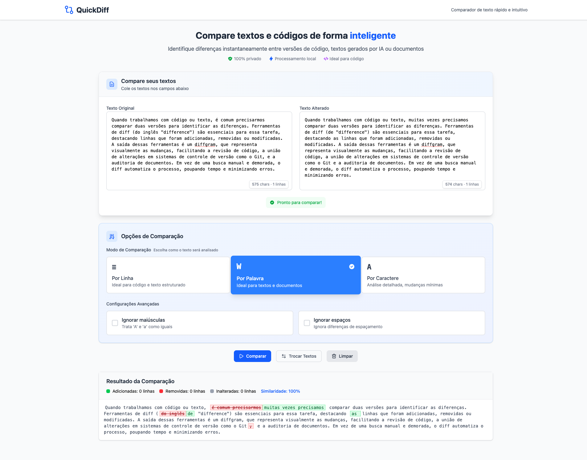

# 🔍 QuickDiff

> **Compare textos e códigos de forma inteligente**

Uma ferramenta web moderna para identificar diferenças instantaneamente entre versões de código, textos gerados por IA ou documentos. **100% privado** com processamento local no navegador.

## ✨ Funcionalidades

- 🔄 **Comparação inteligente** - Por linha, palavra ou caractere
- 🎨 **Visualização clara** - Diferenças destacadas em cores
- 🔒 **100% privado** - Todo processamento é feito localmente

## 🚀 Acesse Online

**[https://maxsbot.github.io/QuickDiff/](https://maxsbot.github.io/QuickDiff/)**

## 📸 Demonstração



*Demonstração comparando dois textos sobre diferenças - a ferramenta identifica automaticamente mudanças, adições e remoções com visualização clara e estatísticas em tempo real.*

## 🛠️ Desenvolvimento Local

```bash
# Clonar o repositório
git clone https://github.com/maxsbot/QuickDiff.git
cd QuickDiff

# Instalar dependências
npm install

# Iniciar servidor de desenvolvimento
npm run dev

# Build para produção
npm run build
```

## 🏗️ Stack

- **React 19** - Interface de usuário
- **Vite** - Build tool e dev server
- **Tailwind CSS v4** - Styling moderno
- **diff** - Algoritmo de comparação
- **Lucide React** - Ícones elegantes
- **GitHub Pages** - Hospedagem

## 📋 Casos de Uso

- 📝 **Textos gerados por IA** - Compare versões de prompts e respostas
- 💻 **Código** - Revise mudanças em arquivos
- 📄 **Documentos** - Identifique alterações em textos
- 🔍 **Debug** - Compare saídas de logs ou configs

## 🔐 Privacidade

- ✅ **Nenhum dado é enviado** para servidores
- ✅ **Processamento 100% local** no seu navegador
- ✅ **Sem cookies** ou rastreamento
- ✅ **Código aberto** e auditável

## 📄 Licença

MIT License - veja [LICENSE](LICENSE) para detalhes.

---

<div align="center">
  <strong>Desenvolvido por</strong><br>
  <a href="https://ms.dev" target="_blank">
    
  </a>
  <br>
  <sub>🚀 MS.DEV - Soluções em Tecnologia</sub>
</div>
